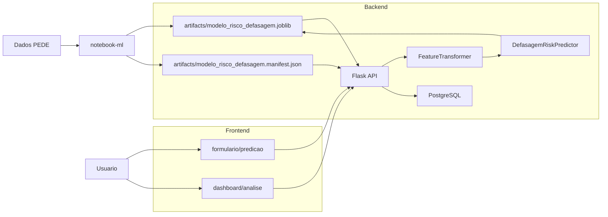
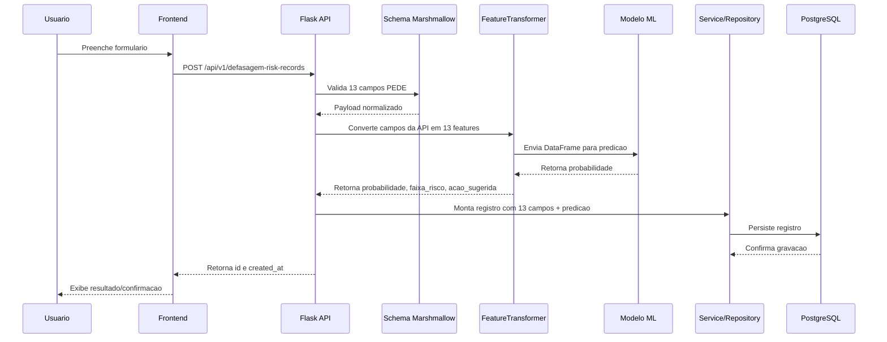

# README-Fluxo: arquitetura backend, modelo ML e consumo pelo Streamlit

## 1. Objetivo do documento

Este documento descreve, em linguagem academica, o fluxo de construcao e uso da solucao de Machine Learning aplicada a predicao de risco de defasagem escolar. A descricao foi elaborada a partir da implementacao existente no projeto `backend`.

O objetivo e demonstrar como o modelo treinado no notebook e incorporado ao backend, como a API organiza suas rotas e responsabilidades, e como uma interface externa pode consumir esses recursos para cadastrar dados, obter predicoes e consultar registros.

## 2. Visao geral da arquitetura

O fluxo pode ser interpretado em tres blocos principais:

1. Camada de ciencia de dados: usa o notebook para treinar o modelo com dados PEDE e gerar o artefato serializado.
2. Camada backend: hospeda a API Flask, carrega o modelo, valida as entradas, executa a predicao e persiste os registros no banco.
3. Camada de apresentacao: interface para interacao do usuario com telas de formulario e dashboard.



## 3. Origem do modelo de Machine Learning

A etapa de modelagem ocorre fora do backend, no notebook de ML. Esse notebook usa dados PEDE para preparar os dados, transformar variaveis categoricas e treinar um classificador de risco de defasagem.

O modelo gerado e disponibilizado ao backend por meio de dois arquivos:

| Arquivo | Funcao |
| --- | --- |
| `artifacts/modelo_risco_defasagem.joblib` | Modelo serializado com `joblib`; contem o pipeline de ML. |
| `artifacts/modelo_risco_defasagem.manifest.json` | Manifesto de verificacao do modelo; registra algoritmo, versao, tamanho, hash SHA-256, features esperadas e faixas de risco. |

O manifesto e essencial para garantir reprodutibilidade e controle de integridade. Ao iniciar, a API verifica se o arquivo `.joblib` corresponde ao hash e tamanho definidos no manifesto. Se houver divergencia, a aplicacao falha em vez de utilizar um modelo inconsistente.

## 4. Modelo utilizado no backend

O manifesto atual identifica o modelo como:

```text
Nome: modelo_risco_defasagem
Versao: 1.0.0
Algoritmo: Pipeline de ML
Scikit-learn: 1.8.0
Quantidade de features esperadas: 13
```

Faixas de risco retornadas pelo modelo:

| Faixa | Probabilidade | Acao sugerida |
| --- | --- | --- |
| Baixo | 0.00 - 0.25 | Sem sinal de alerta |
| Medio | 0.25 - 0.50 | Monitorar no proximo ciclo |
| Alto | 0.50 - 1.00 | Prioridade de acompanhamento |

O backend nao recebe os campos `probabilidade`, `faixa_risco` ou `acao_sugerida` do usuario. Esses valores sao sempre calculados no servidor pelo modelo de Machine Learning.

## 5. Inicializacao do backend

A aplicacao Flask e criada em `app/__init__.py` pela funcao `create_app`.

Durante a inicializacao, o backend:

1. Carrega as configuracoes de ambiente, como `APP_ENV` e `DATABASE_URL`.
2. Inicializa extensoes Flask, SQLAlchemy e Flask-Smorest.
3. Registra as rotas de saude, dominios e registros de risco de defasagem.
4. Registra middlewares de log e `X-Request-ID`.
5. Registra tratadores globais de erro em formato `application/problem+json`.
6. Carrega e valida o artefato de Machine Learning.
7. Armazena o preditor em `app.config["ML_PREDICTOR"]`.

O arquivo `wsgi.py` expoe a aplicacao para execucao com Gunicorn:

```python
from app import create_app

app = create_app()
```

No Dockerfile, a API e executada com:

```text
gunicorn --bind=0.0.0.0:8000 --workers=2 --timeout=30 --graceful-timeout=30 wsgi:app
```

## 6. Fluxo de predicao e persistencia

O fluxo principal ocorre quando o cliente envia um formulario para `POST /api/v1/defasagem-risk-records`.



Na pratica, a responsabilidade do backend e impedir que o cliente defina manualmente a probabilidade ou faixa de risco. O usuario envia apenas os atributos de entrada e o sistema calcula a predicao de forma centralizada.

## 7. Contrato de entrada do cadastro

A rota `POST /api/v1/defasagem-risk-records` aceita exatamente 13 campos PEDE. O schema `DefasagemRiskRecordCreateSchema` rejeita campos desconhecidos; portanto, se o cliente enviar `probabilidade`, `faixa_risco` ou `acao_sugerida`, a API retorna erro de validacao.

Campos recebidos:

| Campo da API | Tipo | Responsabilidade |
| --- | --- | --- |
| `defasagem` | numerico | Defasagem escolar em anos. |
| `fase_ordem` | inteiro | Fase de escolaridade (1-9). |
| `idade` | inteiro | Idade do aluno (6-18 anos). |
| `ano_ingresso` | inteiro | Ano de ingresso na escola. |
| `ida` | numerico | Indicador de Desempenho Academico (0-10). |
| `ieg` | numerico | Indicador de Eficiencia Escolar (0-10). |
| `iaa` | numerico | Indicador de Aproveitamento Anual (0-10). |
| `ips` | numerico | Indicador de Progresso Escolar (0-10). |
| `ipv` | numerico | Indicador de Proficiencia em Portugues (0-10). |
| `inde` | numerico | Indicador de Desempenho Escolar (0-10). |
| `genero` | texto | Gênero (masculino/feminino). |
| `instituicao` | texto | Tipo de instituicao (publica/privada). |
| `pedra` | texto | Pedra (quartil_1/quartil_2/quartil_3/quartil_4). |

Exemplo de payload:

```json
{
  "defasagem": 1.5,
  "fase_ordem": 3,
  "idade": 10,
  "ano_ingresso": 2020,
  "ida": 7.8,
  "ieg": 8.2,
  "iaa": 6.5,
  "ips": 9.1,
  "ipv": 7.3,
  "inde": 8.0,
  "genero": "masculino",
  "instituicao": "publica",
  "pedra": "quartil_1"
}
```

## 8. Transformacao dos dados para o modelo

O backend nao envia diretamente o payload bruto para o modelo. Antes da inferencia, o modulo `app/ml/feature_transformer.py` converte os 13 campos PEDE da API em um `DataFrame` com 13 features, na mesma ordem esperada pelo `modelo_risco_defasagem.joblib`.

| Feature do modelo | Origem no payload | Transformacao |
| --- | --- | --- |
| `defasagem` | `defasagem` | Conversao direta. |
| `fase_ordem` | `fase_ordem` | Conversao direta. |
| `idade` | `idade` | Conversao direta. |
| `ano_ingresso` | `ano_ingresso` | Conversao direta. |
| `ida` | `ida` | Conversao direta. |
| `ieg` | `ieg` | Conversao direta. |
| `iaa` | `iaa` | Conversao direta. |
| `ips` | `ips` | Conversao direta. |
| `ipv` | `ipv` | Conversao direta. |
| `inde` | `inde` | Conversao direta. |
| `genero` | `genero` | Conversao direta. |
| `instituicao` | `instituicao` | Conversao direta. |
| `pedra` | `pedra` | Conversao direta (ordinal encoding interno do modelo). |

## 9. Responsabilidades das camadas

| Camada/Modulo | Responsabilidade principal |
| --- | --- |
| `notebook-ml` | Treinar e avaliar o modelo de Machine Learning a partir de dados PEDE. |
| `artifacts/modelo_risco_defasagem.joblib` | Armazenar o pipeline treinado usado em inferencia. |
| `artifacts/modelo_risco_defasagem.manifest.json` | Registrar metadados e integridade do modelo. |
| `app/__init__.py` | Criar a aplicacao Flask, registrar rotas e carregar o preditor ML. |
| `app/api/*_routes.py` | Expor os endpoints HTTP do backend. |
| `app/schemas/*` | Validar requests e serializar responses. |
| `app/ml/model_loader.py` | Verificar SHA-256/tamanho do artefato e carregar o modelo. |
| `app/ml/feature_transformer.py` | Converter campos da API para as 13 features esperadas pelo modelo. |
| `app/ml/predictor.py` | Executar `model.predict_proba` e classificar em faixas de risco. |
| `app/services/defasagem_risk_record_service.py` | Coordenar caso de uso: predizer, montar registro, persistir e controlar transacao. |
| `app/repositories/defasagem_risk_record_repository.py` | Isolar operacoes de banco de dados para registros de risco de defasagem. |
| `app/models/defasagem_risk_record.py` | Definir tabela, tipos e restricoes SQL do registro persistido. |
| `migrations/` | Versionar a estrutura do banco de dados. |
| `seeds/domain_options.py` | Popular dominios usados por formularios e validacoes. |
| `Dockerfile` | Empacotar a API para execucao em ambiente conteinerizado. |
| `compose.yaml` | Orquestrar API, migracao e PostgreSQL em ambiente local. |

## 10. Rotas e responsabilidades

| Metodo | Rota | Responsabilidade |
| --- | --- | --- |
| `GET` | `/health/live` | Verificar se o processo da API esta ativo. |
| `GET` | `/health/ready` | Verificar se a API esta pronta para operar, incluindo acesso ao banco. |
| `GET` | `/api/v1/domains` | Listar dominios ativos para montar formularios no cliente. |
| `GET` | `/api/v1/domains/{field_name}` | Consultar os valores aceitos para um campo especifico. |
| `POST` | `/api/v1/defasagem-risk-records` | Receber 13 campos PEDE, predizer probabilidade/faixa/acao, persistir o registro e retornar identificadores. |
| `GET` | `/api/v1/defasagem-risk-records` | Listar registros cadastrados, incluindo a predicao de risco. |
| `GET` | `/api/v1/defasagem-risk-records/{record_id}` | Consultar um registro especifico por UUID. |
| `GET` | `/api/openapi.json` | Expor o contrato OpenAPI gerado pela aplicacao. |
| `GET` | `/api/docs` | Disponibilizar a documentacao Swagger UI. |

## 11. Persistencia dos dados

Cada registro persistido contem:

- os 13 campos PEDE informados pelo usuario;
- os campos `probabilidade`, `faixa_risco` e `acao_sugerida`, calculados pelo modelo;
- `id`, gerado como UUID;
- `created_at`, gerado pelo banco.

O modelo SQL `DefasagemRiskRecord` define restricoes para manter a consistencia dos dados. Isso complementa a validacao da camada de schema e reduz o risco de gravacao de valores fora dos dominios esperados.

Na implementacao, o backend usa PostgreSQL e recebe a conexao por `DATABASE_URL`.

## 12. Papel do frontend no fluxo

O frontend atua como cliente da API:

| Componente | Papel no fluxo |
| --- | --- |
| Formulario | Interface de formulario. Envia os 13 campos PEDE para a API e apresenta ao usuario o resultado da predicao/cadastro. |
| Dashboard | Interface analitica. Consulta registros e dominios pela API para apresentar dados consolidados ao usuario. |

Assim, o frontend nao executa o modelo diretamente. Ele atua como cliente da API. Essa separacao e relevante porque centraliza a regra de inferencia no backend, evitando divergencia entre multiplas interfaces.

## 13. Integridade, rastreabilidade e observabilidade

A solucao possui mecanismos importantes para um trabalho academico e para uma evolucao futura:

- Verificacao de integridade do modelo por SHA-256 e tamanho do arquivo.
- Manifesto com features e faixas de risco esperadas pelo modelo.
- Logs estruturados em JSON.
- Propagacao de `X-Request-ID` em todas as respostas.
- Erros padronizados em `application/problem+json`.
- Contrato OpenAPI validado por teste automatizado.
- Separacao entre rotas, schemas, servicos, repositorios e camada de ML.

Essas decisoes aumentam reprodutibilidade, manutencao e capacidade de auditoria.

## 14. Qualidade e testes

O projeto possui testes unitarios, de contrato e de integracao. O `pyproject.toml` configura cobertura minima de 90% e ferramentas de qualidade:

```text
pytest
pytest-cov
ruff
mypy
```

O teste de contrato OpenAPI confirma que as rotas publicadas sao:

```text
/health/live
/health/ready
/api/v1/domains
/api/v1/domains/{field_name}
/api/v1/defasagem-risk-records
/api/v1/defasagem-risk-records/{record_id}
```

Tambem confirma que o schema de criacao possui 13 campos obrigatorios e nao exige `probabilidade`, `faixa_risco` ou `acao_sugerida` no payload de entrada.

## 15. Limitacoes observadas

Alguns pontos merecem registro para transparencia academica:

1. O backend atual recebe 13 campos PEDE de entrada e transforma esses campos em 13 features.
2. O artefato `modelo_risco_defasagem.joblib` contem a pipeline completa de ML.
3. A transformacao de features foi implementada no backend em `FeatureTransformer` para manter compatibilidade com o contrato da API.
4. A exposicao publica exige cuidados adicionais, como autenticacao, autorizacao, politicas de privacidade, consentimento, retencao de dados e seguranca de transporte.

## 16. Conclusao academica

A arquitetura implementada demonstra a passagem de um experimento de Machine Learning para uma solucao operacionalizada em backend. O notebook e responsavel pela etapa experimental e pela geracao do modelo; o backend transforma esse artefato em um servico acessivel por HTTP; o banco armazena os registros enriquecidos com a predicao; e o frontend atua como camada de interacao com o usuario.

Essa divisao de responsabilidades favorece manutencao, reprodutibilidade e evolucao incremental. O backend centraliza a inferencia, padroniza validacoes e registra os resultados, enquanto a interface de apresentacao permanece desacoplada da logica de Machine Learning.

Para evolucao futura, recomenda-se reforcar controles de seguranca antes de uma exposicao publica ampla.
